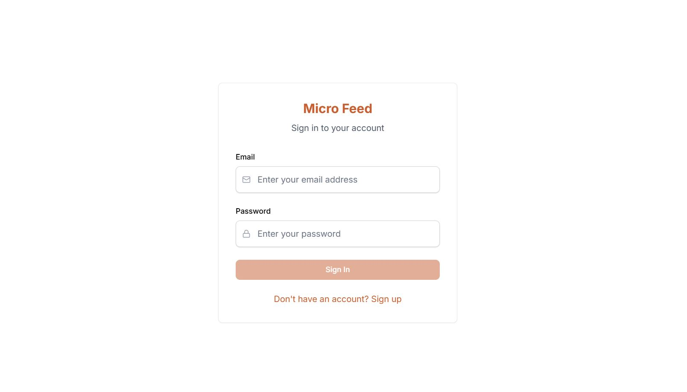
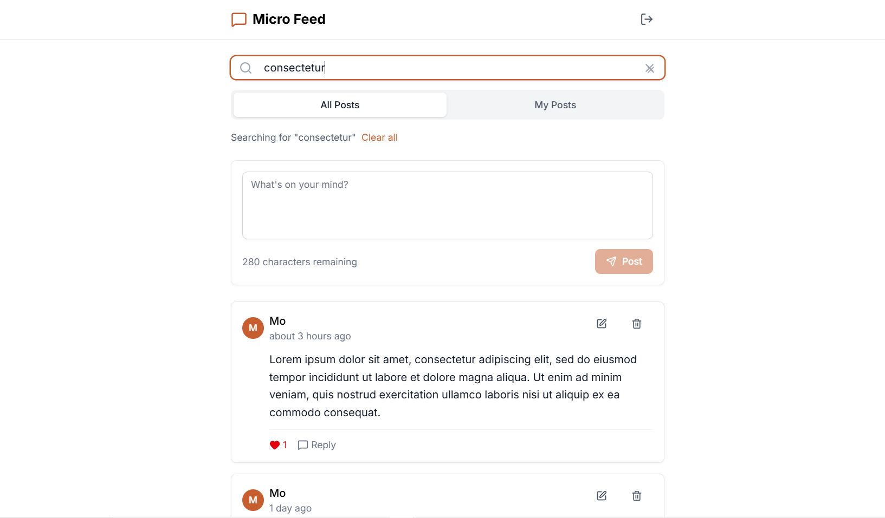
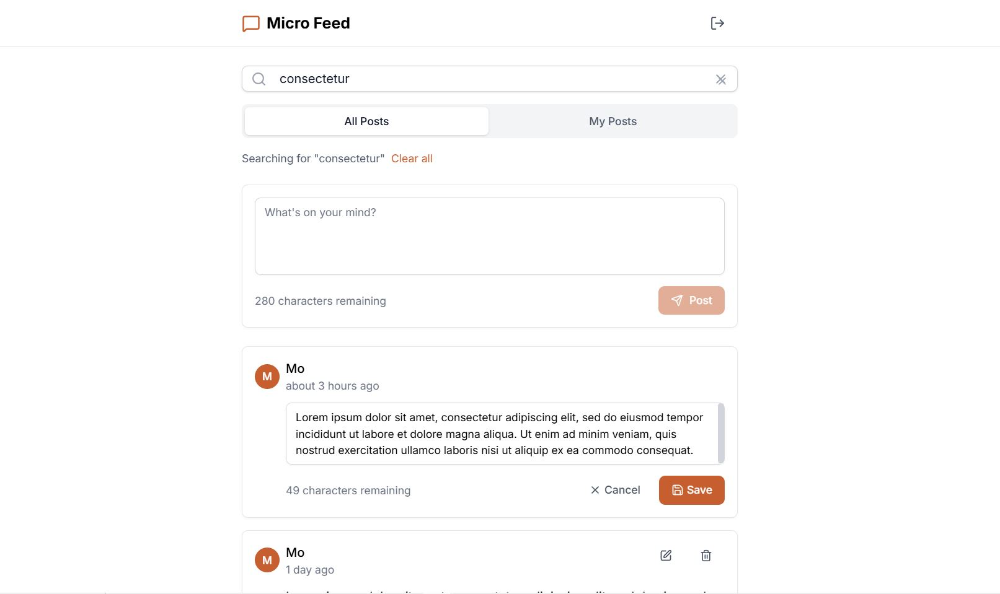

# Micro Feed

A modern micro-blogging platform built with Next.js 15.5.0, TypeScript, and Supabase. Users can create short posts (≤280 characters), like/unlike posts, search content, and manage their own posts with real-time optimistic updates.

## Screenshots

### Sign In / Sign Up


### Feeds


### Post Update



## Features

- **Authentication**: Secure user registration and login with Supabase Auth
- **Post Management**: Create, edit, and delete posts (280 character limit)
- **Social Interactions**: Like/unlike posts with optimistic UI updates
- **Search & Filter**: Real-time search and filter by "All Posts" or "My Posts"
- **Responsive Design**: Works on desktop and mobile devices
- **Real-time Updates**: Optimistic UI for instant feedback

## Tech Stack

- **Frontend**: Next.js, TypeScript, Tailwind CSS
- **Backend**: Supabase (Database + Authentication)
- **State Management**: React hooks with optimistic updates
- **Validation**: Zod schemas for client and server-side validation
- **Styling**: Tailwind CSS with custom color scheme 

## Prerequisites

- Node.js 18+ and npm
- Supabase account

## Quick Setup

### 1. Clone and Install
```bash
git clone <your-repo-url>
cd micro-feed
npm install
```

### 2. Supabase Setup
1. Create a new project at [supabase.com](https://supabase.com)
2. Go to SQL Editor and run the schema (see below)
3. Get your project URL and anon key from Settings > API

### 3. Environment Variables
Create `.env.local`:
```env
NEXT_PUBLIC_SUPABASE_URL=your_supabase_project_url
NEXT_PUBLIC_SUPABASE_ANON_KEY=your_supabase_anon_key
```

### 4. Database Schema
Run this SQL in your Supabase SQL Editor:

```sql
-- auth.users is provided by Supabase
create table if not exists profiles (
  id uuid primary key references auth.users(id) on delete cascade,
  username text unique not null,
  created_at timestamptz default now()
);

create table if not exists posts (
  id uuid primary key default gen_random_uuid(),
  author_id uuid not null references profiles(id) on delete cascade,
  content text not null check (char_length(content) <= 280),
  created_at timestamptz default now(),
  updated_at timestamptz default now()
);

create table if not exists likes (
  post_id uuid references posts(id) on delete cascade,
  user_id uuid references profiles(id) on delete cascade,
  created_at timestamptz default now(),
  primary key (post_id, user_id)
);

-- Enable Row Level Security
alter table profiles enable row level security;
alter table posts enable row level security;
alter table likes enable row level security;

-- Security Policies
create policy "read profiles" on profiles for select using (true);
create policy "upsert self profile" on profiles
for all using (auth.uid() = id) with check (auth.uid() = id);

create policy "read posts" on posts for select using (true);
create policy "insert own posts" on posts for insert with check (auth.uid() = author_id);
create policy "update own posts" on posts for update using (auth.uid() = author_id);
create policy "delete own posts" on posts for delete using (auth.uid() = author_id);

create policy "read likes" on likes for select using (true);
create policy "like" on likes for insert with check (auth.uid() = user_id);
create policy "unlike" on likes for delete using (auth.uid() = user_id);
```

### 5. Authentication Settings
In Supabase Dashboard:
1. Go to Authentication > Settings
2. Add `http://localhost:3000` to "Site URL"
3. Add `http://localhost:3000/**` to "Redirect URLs"

### 6. Run the Application
```bash
npm run dev
```

Visit `http://localhost:3000` and create an account to get started!


## Design Decisions

### Server Actions vs Route Handlers
**Choice**: Server Actions

**Rationale**: Server Actions provide better type safety, automatic revalidation, and seamless form integration. They eliminate the need for manual fetch calls and provide better error handling out of the box. Since this is a relatively small app, Server Actions are simpler and reduce boilerplate compared to setting up dedicated API route handlers. For this CRUD-heavy application, Server Actions improve developer experience and keep the codebase cleaner.


### Optimistic Updates Strategy
**Implementation**: React's `useOptimistic` hook with `useTransition`

**Benefits**:
- Instant UI feedback for likes and post creation
- Automatic rollback on errors
- Better perceived performance
- Works seamlessly with Server Actions and revalidation

### Row Level Security (RLS) Approach
**Philosophy**: Defense in depth with granular permissions

**Policies**:
- Users can read all posts and profiles (public feed)
- Users can only create/edit/delete their own posts
- Like system allows users to like any post but only manage their own likes
- Profile management restricted to own profile

### Error Handling
- Client-side validation with Zod before submission
- Server-side validation as the source of truth
- User-friendly error messages with fallback alerts
- Optimistic updates handle failures gracefully

## Tradeoffs & Timeboxing

### What's Included 
- Core functionality (CRUD posts, likes, search, auth)
- Responsive design 
- Optimistic updates for better UX
- Proper validation and error handling
- Security with RLS policies

### What's Simplified 
- **Pagination**: Cursor-based but could be improved with infinite scroll
- **Rich text**: Plain text only (no markdown/formatting)
- **Image uploads**: Text-only posts
- **User profiles**: Minimal profile system
- **Notifications**: No notification system

### What's Missing / What I skipped (and why)
- Dark/Light Mode – Originally planned, but removed due to time constraints. I prioritized core CRUD, auth, and    optimistic updates over UI polish since those demonstrate more critical fullstack skills.
- Advanced features like comments, following system,Advanced search filters (by date, user, etc.) or notifications were skipped to keep the scope small and finish within the timebox.
- Consistent styling in all components – Some UI elements could be refined further, but I focused on ensuring the main features work reliably.
- Image uploads & rich text editing – Limited to plain text posts to reduce complexity and keep the database schema minimal.

Why:
The assignment emphasized structure, correctness, and clarity over completeness of features. To manage time effectively, I focused on delivering a working, maintainable app with authentication, posts, likes, search, and optimistic UI as the highest-value features.

